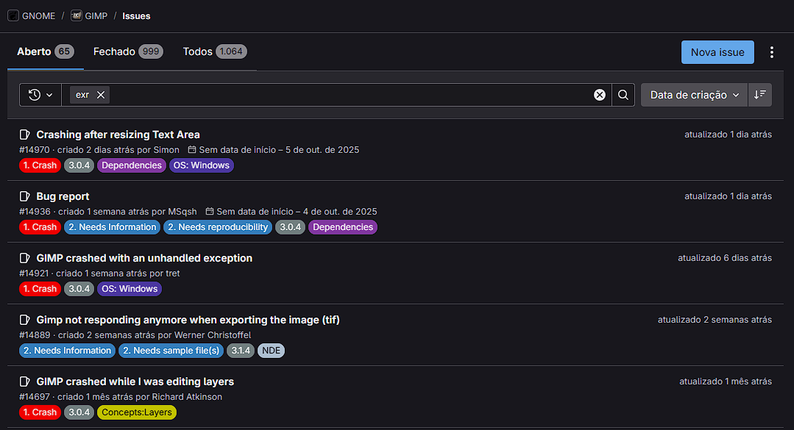

# Justificativa e Objetivos da Avaliação

## Módulo file-exr do Software GIMP

### **1. Introdução**

Este documento tem como objetivo apresentar a justificativa e os objetivos que norteiam a avaliação de qualidade do módulo `file-exr`, um componente do software de edição de imagens GIMP. A análise proposta utilizará como base conceitual as características de qualidade de produto definidas pela norma ISO/IEC 25010, focando nos aspectos mais críticos para a usabilidade e aceitação do software em ambientes de produção profissional.

### **2. Justificativa da Avaliação**

A avaliação de qualidade do módulo `file-exr` do GIMP justifica-se por sua importância estratégica e pelos riscos operacionais associados ao seu funcionamento. Este módulo é o principal responsável pela manipulação de arquivos no formato OpenEXR (`.exr`), padrão da indústria para imagens de alta faixa dinâmica (HDR). Uma análise preliminar revelou a existência de diversas **[issues](https://gitlab.gnome.org/GNOME/gimp/-/issues/?sort=created_date&state=opened&search=exr&first_page_size=20)** (relatos de problemas) abertas pela comunidade, que reportam instabilidades e comportamentos inesperados, conforme a Figura 1. Este fato foi um dos principais motivos para a escolha do módulo como objeto de avaliação, tornando uma investigação formal necessária.

Figura 1: Screenshot do painel de Issues do GIMP relacionadas a arquivos EXR

Fonte: [https://gitlab.gnome.org/GNOME/gimp](https://gitlab.gnome.org/GNOME/gimp).

Diante deste cenário, a avaliação se concentra em três características de qualidade fundamentais da norma ISO/IEC 25010, escolhidas para endereçar os principais pontos de risco do módulo.

A **Confiabilidade** surge como a prioridade máxima, visando transformar os relatos de instabilidade em dados concretos. A análise vai além da simples frequência de falhas em uso normal (*maturidade*), aprofundando-se na capacidade do módulo de lidar com arquivos corrompidos de forma segura, sem travar (*tolerância a falhas*). É igualmente crucial avaliar a *recuperabilidade* do sistema, garantindo que a integridade dos dados do usuário seja preservada após um erro, e verificar a *estabilidade sob carga*, para assegurar que o software opere de forma consistente com os arquivos de grande volume comuns em ambientes profissionais.

Em seguida, a **Compatibilidade** justifica-se pela necessidade de garantir que o GIMP se integre a fluxos de trabalho profissionais. A investigação foca na *interoperabilidade* do módulo, assegurando que os arquivos `.exr` possam ser trocados com outros softwares de mercado, como Blender e Krita, sem perda de canais ou metadados. A análise também abrange a *conformidade* do módulo com as variações complexas do padrão OpenEXR, um requisito essencial para que o GIMP seja uma ferramenta viável em pipelines de produção gráfica.

Por fim, a **Portabilidade** visa garantir uma experiência consistente e funcional para a vasta e diversificada base de usuários do GIMP. A avaliação verifica a *adaptabilidade* do módulo para operar de forma idêntica e previsível nos principais sistemas operacionais (Windows, macOS e Linux). Adicionalmente, analisa-se a *reprodutibilidade* de sua compilação, um fator chave para a saúde e manutenção de um projeto de código aberto, que impacta diretamente sua capacidade de evoluir e se adaptar a novas arquiteturas de hardware e tecnologias futuras.

### **3. Objetivos da Avaliação**

Com base na justificativa apresentada, os objetivos específicos e práticos desta avaliação são:

* **Executar** testes de robustez para avaliar a **Confiabilidade** do módulo, submetendo-o a um conjunto de arquivos `.exr` válidos, corrompidos e com parâmetros inesperados, a fim de registrar e classificar as falhas resultantes.
* **Verificar** a **Compatibilidade** (interoperabilidade) do módulo, confirmando que os arquivos gerados pelo GIMP podem ser abertos e interpretados corretamente por, no mínimo, dois outros softwares de referência da indústria (como Krita e Blender), e vice-versa.
* **Confirmar** a **Portabilidade** do módulo, garantindo que sua compilação e execução ocorram sem erros e com comportamento consistente em, no mínimo, dois sistemas operacionais distintos (por exemplo, uma distribuição Linux e Windows).

A descrição mais detalhada das subcaracterísticas utilizadas podem ser encontradas na aba de [Modelo de Qualidade e Escopo](5-modelo.md).

### **4. Referências**

> GIMP - The GNU Image Manipulation Program. Disponível em: <https://www.gimp.org>. Acesso em: 27 set. 2025.

> GNOME. GIMP Project Repository. [2025]. Disponível em: <https://gitlab.gnome.org/GNOME/gimp>. Acesso em: 27 set. 2025.

> INTERNATIONAL ORGANIZATION FOR STANDARDIZATION. ISO/IEC 25000: Software engineering — Software product Quality Requirements and Evaluation (SQuaRE) — Guide to SQuaRE. First edition. Geneva: ISO, 2005.

---

### **Histórico de Versão**

| Versão | Data       | Descrição                                         | Autor          | Revisor          |
| :----- | :--------- | :------------------------------------------------ | :------------- | :--------------- |
| 1.0    | 27/09/2025 | Criação da versão inicial do documento de avaliação, com justificativas do porquê das nossas escolhas. | [Arthur Evangelista](https://www.github.com/arthurevg)     | [Caio Venâncio](https://www.github.com/caio-venancio)|
| 1.1    | 01/10/2025 | Adição das justificativas das subcaracterísticas | [Arthur Evangelista](https://www.github.com/arthurevg)     | [Larissa Stéfane](https://github.com/SkywalkerSupreme)|

---