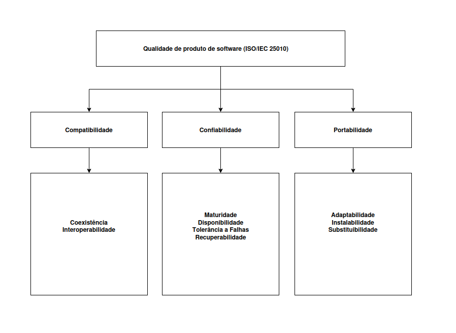

# Modelo de Qualidade e Escopo

## 1. Introdução

**Objetivo:** representar o modelo de qualidade (ISO/IEC 25010) com foco nas três características prioritárias **Confiabilidade**, **Compatibilidade** e **Portabilidade** e definir o escopo e a profundidade de análise para cada uma.

---

## 2. Diagrama (visão geral)

> O diagrama acima representa o modelo central (ISO/IEC 25010) com as três características prioridades para a Fase 1.

---

## 3. Escopo

A avaliação será limitada às três características para esta Fase 1 **Confiabilidade**, **Compatibilidade** e **Portabilidade** — em conformidade com a ISO/IEC 25010. As demais características do modelo (p.ex. Usabilidade, Segurança ampla, Eficiência de Desempenho, Manutenibilidade como foco principal) ficam fora do escopo.

---
## 4. Adaptação do Modelo

O modelo padrão ISO/IEC 25010 foi adaptado para priorizar os aspectos mais críticos ao propósito desta avaliação: garantir a integridade e a intercambialidade de imagens HDR no fluxo profissional render do GIMP. A seleção das características foi guiada pelo cenário de uso (artista VFX que troca arquivos .exr entre diferentes ferramentas) e pela ideia de focar em aspectos técnicos. Foram selecionadas três características de qualidade de produto, descritas a seguir:

---

### 4.1 Confiabilidade

**Definição:** Refere-se à capacidade do módulo `file-exr` de executar leituras, gravações e conversões sem provocar falhas, corrupções ou perda de integridade dos arquivos.

A tabela a seguir apresenta a classificação das subcaracterísticas de Confiabilidade do modelo SQuaRE (ISO/IEC 25010), com a ênfase definida para cada uma em uma escala de 1 (nenhum interesse) a 5 (grande interesse).

| Subcaracterística de Confiabilidade (SQuaRE) | Ênfase (1 a 5) | Justificativa Breve |
|-----------------------------------------------|----------------|----------------------|
| **Maturidade** | 5 – grande interesse | Avalia frequência e severidade de falhas conhecidas, como *crashes* relatados ao abrir ou extrair arquivos EXR, impactando diretamente a confiabilidade percebida pelo usuário final. |
| **Recuperabilidade** | 5 – grande interesse | Foca na manutenção da integridade após falhas. Ex.: rollback de operações e prevenção de arquivos parcialmente corrompidos garantem que o trabalho do usuário não seja perdido. |
| **Tolerância a falhas** | 4 – largo interesse | Observa o comportamento do sistema frente a entradas malformadas ou corrompidas. Idealmente, o GIMP não deve travar, mas tratar o erro sem sobrescrever o original. |
| **Disponibilidade** | 3 – médio interesse | Relevante em menor grau, pois o GIMP é uma aplicação desktop offline, sem dependência de uptime contínuo como sistemas online. |

**Escopo (breve):**
- Operações cobertas: abrir `.exr`, salvar `.exr`, converter (`.exr` ↔ `.hdr`), editar camadas/metadata, operações concorrentes.  
- Tipos de arquivo: válidos, parcialmente corrompidos (header/body), variantes com AOVs/deep.  
- Artefatos para evidência: logs, core dumps, diffs de saída, medições de memória/CPU.

**Profundidade (breve — Níveis):**

- **Nível 1 (triagem):** 10–20 casos representativos para identificar crashes e regressões óbvias, registro de passos e logs.  

- **Nível 2 (validação):** ~100 casos automatizados cobrindo compressões/tamanhos, monitoramento com Valgrind/ASAN em amostras, hash/pixel-compare.

- **Nível 3 (aprofundado):** fuzzing no parser EXR, stress tests concorrentes, análise forense de dumps, recomendações técnicas.

---

### 4.2 Compatibilidade

**Definição:** Refere-se à capacidade do `file-exr` de coexistir e trocar informações com outras ferramentas e formatos do ecossistema gráfico, assegurando que arquivos gerados/alterados pelo GIMP sejam corretamente interpretados por terceiros.

A tabela a seguir apresenta a classificação das subcaracterísticas de Compatibilidade do modelo SQuaRE (ISO/IEC 25010), com a ênfase definida para cada uma em uma escala de 1 (nenhum interesse) a 5 (grande interesse).

| Subcaracterística de Compatibilidade (SQuaRE) | Ênfase (1 a 5) | Justificativa Breve |
|-----------------------------------------------|----------------|----------------------|
| **Interoperabilidade** | 5 – grande interesse | Essencial para garantir que arquivos `.exr` abertos/gerados no GIMP preservem canais e metadados, assegurando integração com ferramentas como Blender, Krita e Natron. |
| **Coexistência** | 4 – largo interesse | Importante para assegurar que o GIMP opere no mesmo ambiente sem conflitos com outros plugins, bibliotecas ou handlers de imagem. |

**Escopo (breve):**
- Validar round-trips: render → GIMP → export → reabrir em pelo menos dois softwares de referência (ex.: Blender e Krita).  
- Cobrir variantes do formato: multilayer, tiled, deep, compressões comuns e incomuns, preservação de AOVs e metadados.  
- Artefatos para evidência: arquivos de entrada/saída, logs dos consumidores, diffs por canal, relatórios PSNR/MSE.

**Profundidade (breve — Níveis):**

- **Nível 1 (verificação manual):** abrir/salvar 5–10 arquivos em ferramentas externas, documentar incompatibilidades. 

- **Nível 2 (testes automatizados):** ~50 arquivos com scripts de comparação (pixel + metadados), relatório de taxa de sucesso por software. 

- **Nível 3 (conformidade/pipeline):** simulação de pipelines reais e métricas de perda de informação.

---

### 4.3 Portabilidade

**Definição:** Refere-se à capacidade do `file-exr` (e da integração com o GIMP) de ser compilado, instalado e executado com comportamento equivalente em diferentes sistemas operacionais e toolchains.

A tabela a seguir apresenta a classificação das subcaracterísticas de Portabilidade do modelo SQuaRE (ISO/IEC 25010), com a ênfase definida para cada uma em uma escala de 1 (nenhum interesse) a 5 (grande interesse).

| Subcaracterística de Portabilidade (SQuaRE) | Ênfase (1 a 5) | Justificativa Breve |
|----------------------------------------------|----------------|----------------------|
| **Adaptabilidade** | 5 – grande interesse | Avalia o esforço necessário para ajustar o plugin entre diferentes ambientes (Linux, Windows, macOS), fator crítico para a ampla adoção. |
| **Instalabilidade / Reprodutibilidade do build** | 5 – grande interesse | Alta relevância pela necessidade de scripts, CI ou Dockerfiles que garantam builds estáveis e consistentes, evitando erros de dependências (ex.: libOpenEXR). |
| **Substituibilidade** | 4 – largo interesse | Importante para permitir substituição de versões de dependências ou compilação em diferentes arquiteturas (x86_64 vs ARM) sem perda de funcionalidades. |

**Escopo (breve):**
- Verificar processo de build/instalação e executar fluxos de import/export em pelo menos 2 SOs (ex.: Ubuntu 22.04 e Windows 11).  
- Checar dependências críticas (libOpenEXR, libgimp) e scripts/CI/Dockerfiles.  
- Artefatos para evidência: logs de build, binários gerados, scripts de instalação e resultados dos testes por SO.

**Profundidade (breve — Níveis):**

- **Nível 1 (checagem documental + build simples):** revisar documentação de build, realizar uma build local em 1 SO e documentar falhas. 

- **Nível 2 (builds e testes em múltiplos SOs):** compilar/instalar e executar testes básicos em 2 SOs, automatizar verificação de import/export, documentar ajustes.  

- **Nível 3 (reprodutibilidade e ABI):** criar ambientes reprodutíveis (Docker/VM/CI), executar builds em 3 SOs e avaliar compatibilidade ABI e cross-arch.

---

## 5. Referências Bibliográficas

  > 1. ISO/IEC 25010. Características e subcaracterísticas de qualidade. Disponível em: https://www.researchgate.net/figure/Characteristics-and-Sub-characteristics-of-the-ISO-IEC-25010-quality-model_tbl1_273476036. Acesso em: 27 set. 2025.
  
  > 2. GIMP. The GNU Image Manipulation Program. Disponível em: https://www.gimp.org. Acesso em: 27 set. 2025. 

## **Histórico de Versão**

| Versão | Descrição | Autor | Revisor | Data |
|:--:|:---------|:------|:--------|:----:|
| 1.0 | Criação do Documento | [Vinicius Castelo](https://github.com/Vini47) | [Breno Alexandre](https://github.com/brenoalexandre0) | 27/09/2025 |
| 1.1 | Reformulação das subcaracterísticas e adição das referências | [Breno Alexandre](https://github.com/brenoalexandre0) | [Vinicius Castelo](https://github.com/Vini47) | 01/10/2025 |
