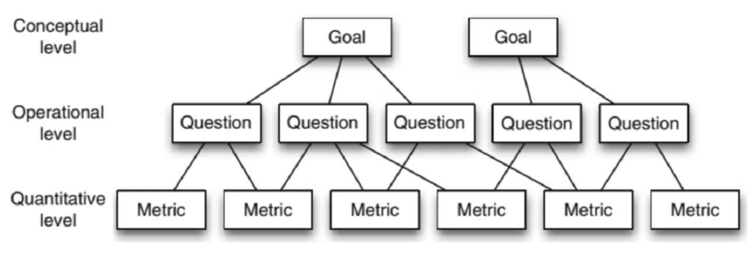

# Sobre a Fase 2

## Introdução

Nesta etapa, adotou-se a abordagem GQM (Goal-Question-Metric), que permite traduzir objetivos de qualidade em questões específicas e métricas mensuráveis, garantindo uma análise prática e estruturada da qualidade do software, servindo como base para recomendações futuras e para a comparação com outros produtos de edição gráfica em termos de confiabilidade, compatibilidade e portabilidade.

## Sobre o GQM

O GQM, sigla para Goal-Question-Metric (Obhetivo-Questão-Métrica), é uma abordagem metodológica estruturada usada na engenharia de software para definir e avaliar objetivos de qualidade. O seu propósito é garantir que toda medição seja orientada por um objetivo claro, evitando a coleta de dados desnecessários.

Conforme ilustrado na Figura 1, o GQM estabelece um fluxo hierárquico top-down (de cima para baixo), que conecta os objetivos estratégicos aos dados coletados:

- **Nível Conceitual (Goal / Objetivo)**: É o nível mais alto; define o porquê da medição. Estabelece o objetivo principal que se deseja alcançar.

- **Nível Operacional (Question / Questão)**: Detalha o que precisamos saber para determinar se a meta foi atingida. As questões decompõem a meta abstrata em componentes específicos e investigáveis.

- **Nível Quantitativo (Metric / Métrica)**: É a base do processo; define como vamos medir. São as métricas que fornecem os dados quantitativos necessários para responder objetivamente a cada questão.

Figura 1: Imagem Ilustrativa da Estrutuar do GQM

Fonte: Adaptado de (Wohlin et al., 2012) [[1]](#ref-01).

Dessa forma, o GQM cria essa cadeia de rastreabilidade: as Métricas fornecem as respostas para as Questões, e as Questões, em conjunto, validam o atingimento do Obketivo.

## Artefatos

Ao longo dos arquivos, são abordados:

- Medição da confiabilidade do módulo File-exr do GIMP em: [Confiabilidade](1-confiabilidade.md).
- Medição da compatibilidade do módulo File-exr do GIMP em: [Compatibilidade](2-compatibilidade.md).
- Medição da portabilidade do módulo File-exr do GIMP em: [Portabilidade](3-portabilidade.md).
- A tabela de contribuição dos participantes da equipe em: [Tabela de contribuição](4-tabela%20de%20contribuição.md).

## Referências Bibliográficas

[11] BASILI, Victor R.; CALDIERA, Gianluigi; ROMBACH, H. Dieter. **The Goal Question Metric Approach**. In: *Encyclopedia of Software Engineering*. 2. ed. New York: John Wiley & Sons, 1994. p. 528-532.

### **Histórico de Versão**

| Versão | Data       | Descrição                                         | Autor          | Revisor          |
| :----- | :--------- | :------------------------------------------------ | :------------- | :--------------- |
| 1.0    | 12/10/2025 | Criação do artefato. | [Breno Alexandre](https://www.github.com/brenoalexandre0) | [Caio Venâncio](https://www.github.com/caio-venancio) |
| 1.1    | 24/10/2025 | Adição do Tópico 'Sobre o GQM'. | [Arthur Evangelista](https://www.github.com/arthurevg) | [Caio Venâncio](https://www.github.com/caio-venancio) |