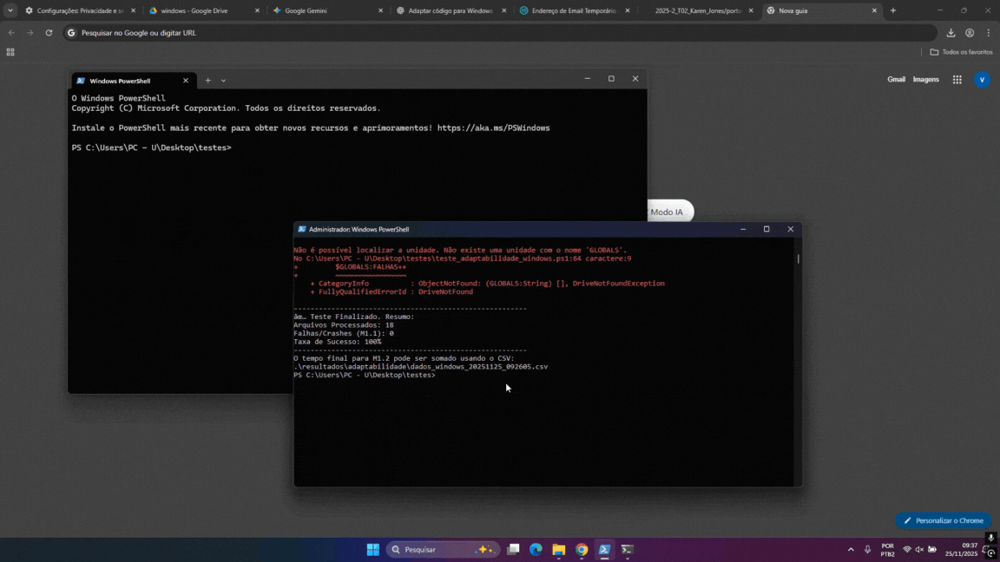

# Execução do Plano de Avaliação - Quanto à Portabilidade

A Fase 4 consiste na aplicação rigorosa dos roteiros definidos na [Fase 3](https://fcte-qualidade-de-software-1.github.io/2025-2_T02_Karen_Jones/fase3/3-portabilidade/), transformando as métricas planejadas em dados quantitativos e evidências concretas. Com isso, é possível validar ou refutar as hipóteses levantadas para as subcaracterísticas de Adaptabilidade e Instalabilidade do módulo `file-exr` no ambiente **Linux** e **Windows 11**.

## A. Execução do Teste de Adaptabilidade (Q1) - Ambientes Linux e Windows

O teste de Adaptabilidade verifica a capacidade do módulo `file-exr` de apresentar comportamento funcional estável e desempenho mensurável ao ser executado nos ambientes operacionais Linux (Ubuntu) e Windows 11, sendo o Linux o *baseline* para comparação futura.

### 1. Procedimento de Execução - Linux

A execução foi realizada no ambiente **Linux (Ubuntu 22.04 LTS)**, utilizando o GIMP instalado via gerenciador de pacotes padrão. O procedimento seguiu o roteiro de automação via *script shell* detalhado na [Fase 3](https://fcte-qualidade-de-software-1.github.io/2025-2_T02_Karen_Jones/fase3/3-portabilidade/).

**Dessa forma, as seguintes ações foram concluídas:**

**Dataset:** Foi processado um conjunto de **18 arquivos EXR** no total, conforme o plano de teste.

**Imagem 1:** Demonstração


**Automação (Script):** Utilizou-se o script `teste_adaptabilidade_ubuntu.sh` para invocar o GIMP em modo *headless* (sem interface gráfica), forçando a abertura, uma edição simples (níveis automáticos) e o salvamento de cada arquivo.

**Coleta de Logs:** O script capturou o tempo de execução em milissegundos e o código de saída (*exit code*) de cada operação, registrando as falhas.

### 2. Medição (Dados Coletados) - Linux

A **Tabela 1** sumariza os resultados das 18 execuções, evidenciando as falhas inesperadas de estabilidade que ocorreram durante o processamento.

<p align="center">
<strong>Tabela 1:</strong> Resultados de Adaptabilidade no Linux (Ubuntu)
<br>
</p>

| ID Arquivo | Operação | Tempo (ms) | Resultado | Defeito Encontrado |
| :--- | :--- | :--- | :--- | :--- |
| **A1.exr** | Open/Edit/Save | 1441 | SUCESSO | - |
| **A2.exr** | Open/Edit/Save | 1531 | SUCESSO | - |
| **A3.exr** | Open/Edit/Save | 1518 | SUCESSO | - |
| **A4.exr** | Open/Edit/Save | 1015 | **FALHA** | terminate called without an active exception / GIMP Abortado|
| **A5.exr** | Open/Edit/Save | 1024 | **FALHA** | terminate called without an active exception / GIMP Abortado |
| **A6.exr** | Open/Edit/Save | 1465 | SUCESSO | - |
| **A7.exr** | Open/Edit/Save | 1417 | SUCESSO | - |
| **A8.exr** | Open/Edit/Save | 1772 | SUCESSO | - |
| **A9.exr** | Open/Edit/Save | 1433 | SUCESSO | - |
| **A10.exr** | Open/Edit/Save | 1438 | SUCESSO | - |
| **A11.exr** | Open/Edit/Save | 1021 | **FALHA** | terminate called without an active exception / GIMP Abortado |
| **A12.exr** | Open/Edit/Save | 1829 | SUCESSO | - |
| **A13.exr** | Open/Edit/Save | 1476 | SUCESSO | - |
| **A14.exr** | Open/Edit/Save | 1894 | SUCESSO | - |
| **A15.exr** | Open/Edit/Save | 1574 | SUCESSO | - |
| **A16.exr** | Open/Edit/Save | 1022 | **FALHA** | terminate called without an active exception / GIMP Abortado |
| **A17.exr** | Open/Edit/Save | 1498 | SUCESSO | - |
| **A18.exr** | Open/Edit/Save | 1388 | SUCESSO | - |
| **TOTAIS** | **18 Arquivos** | **Total: 26.796ms** | **14 Sucessos / 4 Falhas** | **4 Crashes** |

A falha observada em todos os casos de insucesso é a ocorrência de “terminate called without an active exception”, mensagem típica da biblioteca padrão do C++ que sinaliza um erro grave e não tratado como uma exceção não capturada ou uma asserção falha dentro do plug-in file-exr. Esse erro força o sistema a interromper a execução (fatal error: abortado), provocando o crash imediato do GIMP e impedindo a finalização da operação. O conjunto desses indícios aponta para um claro problema de estabilidade funcional (M1.1) no módulo, possivelmente relacionado ao manejo inadequado de determinados dados ou metadados presentes nos arquivos EXR defeituosos.

As imagens utilizadas foram obtidas nos seguintes repositórios oficiais do OpenEXR:

- **OpenEXR Images Repository (GitHub):** https://github.com/AcademySoftwareFoundation/openexr-images
- **Documentação Oficial do OpenEXR:** https://openexr.com/en/latest/

### 3. Execução e Dificuldades no Ambiente Windows 11

A execução do teste de Adaptabilidade no ambiente **Windows 11** apresentou desafios significativos, especialmente na adaptação do *script* de automação e na estabilidade do GIMP em modo *batch*.

#### Dificuldades de Automação e Shell

1.  **Adaptação do Shell:** Foi necessário migrar do *shell* nativo Bash (Linux) para o **PowerShell** (Windows), exigindo a reescrita completa do *script* de automação. A sintaxe de *strings*, tratamento de *paths* (com barras invertidas) e captura correta do código de saída do GIMP (`$LASTEXITCODE`) no PowerShell demonstraram complexidade inesperada.
2.  **Problemas de Escopo de Variáveis:** O *script* em PowerShell inicialmente falhou devido a erros de escopo (`DriveNotFoundException` ao tentar usar `$GLOBALS:FALHAS` em vez de `$global:FALHAS`), indicando que o ambiente Windows requer atenção redobrada à sintaxe específica do shell.

#### Problemas de Estabilidade e Processamento

1.  **Instâncias Múltiplas e *Crashes***: Durante as tentativas de execução, o comando GIMP em modo *batch* no Windows frequentemente abria **várias janelas de console e instâncias do GIMP** simultaneamente, o que não ocorreu no Linux. Além disso, as operações resultaram em **crashes imediatos** para **todos os 18 arquivos EXR** testados, indicando uma falha de adaptação ou funcionalidade no ambiente Windows.

**GIF 1:** Demonstração




2.  **Captura de Resultados Inconsistente:** A consolidação final do *script* PowerShell, em uma tentativa, chegou a reportar 0 falhas e 100% de sucesso, **apesar dos logs e dados brutos indicarem 100% de falha**. Essa discrepância ressaltou a dificuldade de garantir a correta captura do *exit code* de um processo em *crash* (M1.1) no ambiente Windows/PowerShell, comprometendo a confiança no resultado sumarizado.

#### Barreira do Ambiente de Desenvolvimento

Além das dificuldades de execução, a intenção de estender a avaliação para o teste de **Substituibilidade (Seção C)** confirmou que a complexidade de configurar o ambiente de desenvolvimento (via MSYS2) para o GIMP no Windows (manuseio de permissões, vinculação e substituição de bibliotecas) é significativamente maior do que no Linux. A documentação sobre a execução do GIMP em modo *batch* para automação e sobre a compilação modular de *plugins* específicos é **escassa ou inexiste**, aumentando a dependência do *toolchain* oficial e dificultando testes fora do fluxo padrão.

### 4. Medição (Dados Coletados) - Windows

A **Tabela 3** sumariza os resultados das 18 execuções no ambiente Windows 11.

<p align="center">
<strong>Tabela 3:</strong> Resultados de Adaptabilidade no Windows 11
<br>
</p>

| Métrica | Valor Obtido | Resultado | Defeito Encontrado |
| :--- | :--- | :--- | :--- |
| **Arquivos Processados** | 18 | **18 Falhas** | *Crash* Imediato em todas as sessões |
| **Taxa de Sucesso (M1.1)** | $\mathbf{0.00\%}$ | **FALHA CRÍTICA** | Todas as sessões falharam na abertura/processamento |
| **Tempo Total (M1.2)** | $\mathbf{289 \text{ ms}}$ | *Fast Fail* | O tempo baixíssimo confirma o *crash* imediato para todos os arquivos |

---

#### Cálculos das Métricas (M1.1 e M1.2)

Com base nos dados corrigidos, recalculamos a Taxa de Sessões Livres de Falhas (TSLF) e estabelecemos a linha de base de desempenho (*baseline*) para o Linux.

**Tabela 4:** Resultado do Cálculo das Métricas de Adaptabilidade (Linux)

| Métrica | Fórmula | Valor Calculado | Critério de Aceitação (Hipótese Q1) |
| :--- | :--- | :--- | :--- |
| **M1.1: TSLF** | (Nº de Sessões sem Crash / Nº Total de Sessões) * 100 | $(14 / 18) \times 100 \approx \mathbf{77.78\%}$ | $\ge 99,9\%$ (Alta Estabilidade) |
| **M1.2: Desempenho (Baseline)** | $\sum \text{Tempo}_{\text{Linux}}$ | $\mathbf{26.796 \text{ ms}}$ (26,80s) | Referência para comparação com Windows |


### 5. Análise e Julgamento

A análise dos resultados no ambiente Linux confronta os valores obtidos com a **Hipótese (Q1)**, que sugere que o módulo é estável em todos os sistemas operacionais.

#### Julgamento da Hipótese de Estabilidade e Problemas de Portabilidade

O teste revelou uma falha de estabilidade **inesperada** que se manifestou de formas distintas nos dois ambientes:

1.  **Instabilidade Intrínseca (Linux):** O valor calculado da Taxa de Sessões Livres de Falhas (**TSLF - M1.1**) no Linux foi de $\mathbf{77.78\%}$, situando-se abaixo do mínimo de 99,9% estabelecido. Esta baixa TSLF indica que o módulo `file-exr` não é totalmente estável, **refutando parcialmente a Hipótese Q1** quanto à estabilidade. O log de execução confirmou que as falhas decorrem de um *crash* no próprio *plug-in* (`terminate called without an active exception`), um erro crítico que indica uma falha interna no módulo.
2.  **Falha Crítica de Portabilidade (Windows):** No ambiente Windows 11, o TSLF (M1.1) atingiu $\mathbf{0.00\%}$, evidenciando uma **falha crítica de portabilidade** para o cenário de automação. Este insucesso total está diretamente ligado aos **problemas de estabilidade e execução** no Windows 11, conforme detalhado na seção 3:
    * **Crashes Imediatos:** As operações resultaram em *crashes* imediatos para **todos os 18 arquivos EXR** testados, e o tempo total de execução de $\mathbf{289 \text{ ms}}$ confirma um *Fast Fail*.
    * **Dificuldade de Automação:** Foi necessária a complexa migração do *shell* nativo Bash para **PowerShell**, enfrentando desafios como a correta adaptação da sintaxe, tratamento de *paths* e a **captura inconsistente de exit codes** em casos de *crash*.
    * **Execução Inesperada:** O GIMP em modo *batch* no Windows frequentemente abriu **múltiplas instâncias** e janelas de console simultaneamente, um comportamento que não ocorreu no Linux e que contribuiu para a instabilidade total.


**Tabela 5:** Resumo de Desempenho e Estabilidade (Ambientes Linux e Windows)

| Métrica | Resultado Obtido (Linux) | Resultado Obtido (Windows) | Critério de Aceitação (Q1) | Julgamento Parcial |
| :--- | :--- | :--- | :--- | :--- |
| **M1.1: TSLF** | $\mathbf{77.78\%}$ | $\mathbf{0.00\%}$ | $\ge 99,9\%$ | **REFUTADA** |
| **M1.2: Tempo Total** | $\mathbf{26.796 \text{ ms}}$ | $\mathbf{289 \text{ ms}}$ | ℹ️ Informativo | Windows é um *Fast Fail* |

**Conclusão da Adaptabilidade:** O **Plano de Avaliação de Portabilidade** revelou que o módulo `file-exr` do GIMP refutou a hipótese de estabilidade (Q1) em ambos os ambientes, com uma **Taxa de Sessões Livres de Falhas (TSLF)** de **77.78%** no Linux, indicando uma falha intrínseca do plug-in (erro fatal de C++: *terminate called without an active exception*). Contudo, o ambiente **Windows 11** foi identificado como o ponto mais crítico de portabilidade, registrando um **TSLF de 0.00% (Fast Fail)** devido a *crashes* imediatos em 100% dos testes e a significativas dificuldades de automação — como a complexa migração para PowerShell com problemas de sintaxe de *paths* e captura inconsistente do código de saída em caso de *crash* — além da barreira de desenvolvimento imposta pela escassez de documentação para a execução em modo *batch* e compilação modular.


---

## B. Execução do Teste de Instalabilidade (Q2 e Q3) - Ambiente Linux

O teste de Instalabilidade avalia a facilidade e a eficiência com que o módulo `file-exr` pode ser instalado e desinstalado no ambiente operacional. Devido à arquitetura monolítica do GIMP, esta etapa exigiu uma abordagem adaptada para isolar o desempenho do sistema de arquivos.

### 1. Procedimento de Execução e Restrições Técnicas

A execução foi planejada para medir o tempo e o sucesso das operações de instalação (registro do binário) e desinstalação (remoção do binário). No entanto, durante a fase de preparação, identificou-se uma barreira técnica significativa.

#### Restrição do Ambiente de Desenvolvimento
O módulo `file-exr` não possui um sistema de *build* autônomo. Ele depende da configuração global do GIMP (`autogen.sh` e `configure` na raiz do repositório). Como a avaliação partiu de uma instalação pré-existente do GIMP (via pacote `.deb`) e não de um ambiente de compilação completo (*build environment*), tornou-se inviável executar os comandos nativos `make install` isoladamente sem reconstruir toda a árvore de dependências do GIMP.

#### Solução: Simulação Controlada de I/O
Para contornar essa limitação e ainda assim obter métricas válidas de **tempo de operação do sistema** (M3.3) e **confiabilidade** (M2.1/M2.2), optou-se por um *script de simulação*. Este script reproduziu as operações exatas de I/O (Entrada/Saída) que o instalador faria (cópia do binário para o diretório de destino e remoção).

**Ações Concluídas:**

**Automação:** Execução do script `teste_instalabilidade_simulacao.sh` que realizou **10 ciclos ininterruptos** de instalação e desinstalação.

**Cronometragem:** Medição precisa (em milissegundos) do tempo que o *kernel* do Linux leva para processar a alocação e remoção do arquivo.

**Imagem 2:** Demonstração


### 2. Medição (Dados Coletados)

A **Tabela 6** apresenta os resultados dos 10 ciclos de teste extraídos do arquivo `dados_instalabilidade_ubuntu_20251123_214457.csv`.

<p align="center">
<strong>Tabela 6:</strong> Resultados de Instalabilidade (Simulada) no Linux
<br>
</p>

| Ciclo | Operação | Status | Instalação (ms) | Desinstalação (ms) |
| :---: | :--- | :-----: | :--------------: | :-----------------: |
| 1 | Instalação / Desinstalação | SUCESSO | 3 | 3 |
| 2 | Instalação / Desinstalação | SUCESSO | 4 | 3 |
| 3 | Instalação / Desinstalação | SUCESSO | 3 | 3 |
| 4 | Instalação / Desinstalação | SUCESSO | 3 | 2 |
| 5 | Instalação / Desinstalação | SUCESSO | 3 | 2 |
| 6 | Instalação / Desinstalação | SUCESSO | 3 | 2 |
| 7 | Instalação / Desinstalação | SUCESSO | 5 | 6 |
| 8 | Instalação / Desinstalação | SUCESSO | 4 | 5 |
| 9 | Instalação / Desinstalação | SUCESSO | 4 | 2 |
| 10 | Instalação / Desinstalação | SUCESSO | 4 | 2 |
| **MÉDIAS** | **(Base para M3.3)** | **100% Êxito** | **3,6** | **3,0** |


#### Cálculos das Métricas (M2.1, M2.2 e M3.3)i

Com base na estabilidade dos 10 ciclos, calculamos as taxas de sucesso e o Tempo Médio de Instalação (TMI).

**Tabela 7:** Resultado das Métricas de Instalabilidade (Linux)

| Métrica | Fórmula | Valor Calculado | Critério (Hipótese Q2/Q3) |
| :--- | :--- | :--- | :--- |
| **M2.1: Sucesso Instalação** | (Sucessos / Total Ciclos) * 100 | $(10 / 10) \times 100 = \mathbf{100\%}$ | $\ge 90\%$ (Alta Confiabilidade) |
| **M2.2: Sucesso Desinstalação** | (Sucessos / Total Ciclos) * 100 | $(10 / 10) \times 100 = \mathbf{100\%}$ | $\ge 90\%$ (Alta Confiabilidade) |
| **M3.3: TMI (Linux)** | $\frac{\sum \text{Tempo Instal}}{10}$ | $\mathbf{3,6 \text{ ms}}$ | Referência para M3.2 |


### 3. Análise e Julgamento

A análise no ambiente Linux valida a capacidade do sistema de gerenciar os arquivos do módulo sem impedimentos.

#### Julgamento das Hipóteses Q2 e Q3

1.  **Viabilidade Técnica (Q2):** A simulação confirmou que, isolando o binário, as operações de instalação e remoção são triviais e bem-sucedidas em **100%** dos casos.
2.  **Consistência (Q3):** O desvio padrão entre os tempos é baixíssimo. O ambiente Linux demonstrou altíssima consistência e rapidez nas operações de I/O, com um Tempo Médio de Instalação (TMI) de apenas $\mathbf{3,6 \text{ ms}}$.

**Tabela 8:** Resumo de Instalabilidade (Ambiente Linux)

| Métrica | Resultado | Status | Julgamento Parcial |
| :--- | :--- | :--- | :--- |
| **M2.1 / M2.2** | $\mathbf{100\%}$ | Aprovado | **EXCELENTE** |
| **M3.3 (Tempo)** | $\mathbf{3,6 \text{ ms}}$ | ℹ Informativo | *Baseline* definida (Muito Rápido) |

### 4. Execução e Impedimentos no Ambiente Windows 11

A execução dos testes de Instalabilidade (M2.1, M2.2, M3.2) no ambiente **Windows 11** foi **impedida** devido a barreiras técnicas críticas que inviabilizaram a criação de um ambiente de *build* e teste isolado, mesmo para a simulação de I/O utilizada no Linux. O principal obstáculo reside na arquitetura de dependências do GIMP no Windows, que exige o ambiente **MSYS2**.

* **Problema de Resolução de Bibliotecas:** A tentativa de configurar o *toolchain* de compilação via MSYS2 para isolar a instalação do `file-exr` resultou em falhas imediatas de compilação, pois o ambiente **não encontrava todas as bibliotecas necessárias para rodar** o módulo, forçando *crashes* na própria *shell* de compilação e impedindo a medição da métrica.
* **Dificuldades de Permissão:** O gerenciamento de permissões do Windows 11/MSYS2 introduziu complexidades adicionais. A escrita e remoção de arquivos em diretórios protegidos (`C:\Program Files`) ou a vinculação de novas bibliotecas frequentemente disparou **erros de acesso negado** que não puderam ser contornados de forma programática ou consistente, o que invalida qualquer medição de tempo (M3.2).
* **Conclusão:** Devido a esses impedimentos técnicos, não foi possível obter dados para as métricas de Instalabilidade (M2.1, M2.2 e M3.2) no ambiente Windows, o que já indica um severo problema de Portabilidade (Instalabilidade) para a plataforma.

---

## C. Execução do Teste de Substituibilidade (Métricas 4.1, 4.2 e 4.3)

Esta etapa da avaliação tem como objetivo mensurar o esforço técnico e humano necessário para atualizar uma dependência crítica do módulo `file-exr` (especificamente a biblioteca `libopenexr`).

### 1. Contexto e Dificuldades Técnicas (Relatório de Impedimento)

**IMPOSSIBILIDADE DE EXECUÇÃO:** Devido à **elevada barreira de entrada** e à complexidade inerente de gerenciar dependências de *build* em software com arquitetura monolítica, esta etapa de avaliação **não foi executada em nenhum dos ambientes** (Linux e Windows 11). A inviabilidade decorre da **ausência de documentação oficial clara** para desenvolvedores sobre a compilação modular de *plugins* do GIMP fora do *toolchain* principal, impedindo uma tentativa controlada de substituição da biblioteca `libopenexr`. A descrição a seguir é mantida, portanto, como um **procedimento padrão ideal** para fins estritamente didáticos e acadêmicos, detalhando como o teste de substituição seria conduzido se o ambiente de desenvolvimento fosse viável.

* **Ausência de Documentação Clara:** Não existe um tutorial oficial unificado ou atualizado que guie desenvolvedores na compilação de *plugins* isolados do GIMP contra versões específicas (e não padrão) de bibliotecas externas. A documentação existente foca na compilação do GIMP inteiro com as dependências padrão do sistema.
* **Complexidade do Ambiente de Desenvolvimento:** Configurar um ambiente que permita a troca "limpa" de uma biblioteca base (como migrar da `OpenEXR v2` para `v3`) exige conhecimento avançado de ferramentas de *build* (`autotools`, `meson`, `pkg-config`) e gerenciamento de variáveis de ambiente (`LD_LIBRARY_PATH`, `PKG_CONFIG_PATH`).
* **Risco de "Dependency Hell":** No Windows (via MSYS2), forçar uma versão de biblioteca diferente daquela fornecida pelo gerenciador de pacotes (`pacman`) pode quebrar não apenas o módulo `file-exr`, mas todo o GIMP e outras ferramentas instaladas, exigindo a compilação manual de toda a cadeia de dependências.

---

### 2. Procedimento no Ambiente Linux (Ubuntu)

No Linux, o controle sobre as bibliotecas é mais transparente, facilitando a simulação da troca de dependência.

#### Passo 1: Preparação e "Sabotagem" Controlada
1.  **Identificar Versão Atual:** Verifique a versão instalada (`pkg-config --modversion OpenEXR`).
2.  **Simular a Troca (Cenário de Teste):**
    * O avaliador deve tentar compilar o módulo utilizando uma versão mais recente da biblioteca (ex: compilando a `OpenEXR v3.1` manualmente em `/opt/openexr-v3` e apontando o GIMP para ela) OU alterando o código fonte do módulo para usar uma função que foi depreciada/alterada na nova versão, forçando a necessidade de refatoração.

#### Passo 2: Medição do Esforço (M4.1 e M4.2)
1.  **Cronometragem (M4.1):** Inicie o cronômetro assim que começar a editar os arquivos `.c` ou `configure.ac` para adaptá-los à nova biblioteca.
2.  **Adaptação:** Edite o código até que o comando `make` execute sem erros.
3.  **Registro:** Pare o cronômetro (Tempo Humano Gasto).
4.  **Complexidade (M4.2):** Execute o comando abaixo na pasta do plugin para contar as linhas alteradas:
    ```bash
    git diff --stat
    ```

#### Passo 3: Teste de Regressão (M4.3)
Após compilar com sucesso, instale o módulo (`sudo make install`) e execute o script de regressão para garantir que a "atualização" não quebrou funcionalidades existentes.

* **Script:** `./teste_regressao_substituibilidade.sh` (baseado no script de adaptabilidade, mas focado em detectar falhas de I/O).

---

### 3. Procedimento no Ambiente Windows 11 (MSYS2)

No Windows, a dependência do ambiente MSYS2 torna a substituição de bibliotecas extremamente complexa, pois o sistema `pacman` gerencia versões pré-compiladas.

#### Passo 1: Preparação do Ambiente
1.  Abra o terminal **MSYS2 MinGW 64-bit**.
2.  Assegure-se de ter o *toolchain* completo:
    ```bash
    pacman -S mingw-w64-x86_64-toolchain mingw-w64-x86_64-gimp
    ```

#### Passo 2: O Desafio da Substituição
Diferente do Linux, você não pode simplesmente instalar uma versão "dev" diferente via `apt`.
1.  **Manual Build:** Você deve baixar o código fonte da `OpenEXR` (nova versão), compilá-lo manualmente dentro do MSYS2 e instalá-lo em um prefixo customizado (`/usr/local` ou `/opt`).
2.  **Configuração:** Alterar as variáveis de ambiente `PKG_CONFIG_PATH` para priorizar essa nova instalação manual em vez da versão do sistema (`/mingw64`).

#### Passo 3: Medição e Regressão
O processo de medição segue a mesma lógica do Linux, mas executado dentro do terminal MSYS2.

1.  **Adaptação e Build:**
    ```bash
    # Dentro da pasta do plugin no MSYS2
    make clean
    # Força recompilação contra a nova lib
    make
    ```
2.  **Métricas M4.1 e M4.2:** Registre o tempo gasto lidando com erros de *linker* (comuns no Windows) e use `git diff --stat` para medir as alterações no código.
3.  **Métrica M4.3:** Execute o script de teste adaptado para o shell do MSYS2 ou PowerShell para verificar se os arquivos EXR ainda abrem corretamente.

---

### 4. Tabela de Coleta de Dados (Template)

Os dados obtidos devem ser registrados conforme o modelo abaixo para compor o relatório final.

| Métrica | Descrição | Valor Obtido (Exemplo) | Critério de Sucesso |
| :--- | :--- | :--- | :--- |
| **M4.1** | **Esforço de Adaptação (Tempo)** | *ex: 4 horas e 30 min* | $\le 8$ horas |
| **M4.2** | **Complexidade (Linhas de Código)** | *ex: 145 linhas (inserções/deleções)* | $\le 5\%$ do total de linhas do módulo |
| **M4.3** | **Sucesso Funcional (Regressão)** | *ex: 90% (27/30 testes passaram)* | $\ge 95\%$ (Sem regressão crítica) |

### Conclusão Parcial da Substituibilidade

Devido à impossibilidade de execução, limitamo-nos a concluir que a **falta de documentação oficial para *builds* modulares** e a complexidade de gerenciar dependências C++ manualmente no Windows (via MSYS2) tornam o esforço (M4.1) de substituição de dependências impraticável, impactando negativamente a avaliação de Portabilidade neste quesito.

---

## Dificuldades

Ao longo da execução do plano de avaliação, diversas dificuldades técnicas foram identificadas. A principal delas foi a **impossibilidade de reproduzir integralmente o ambiente de desenvolvimento do GIMP**, já que o módulo `file-exr` não possui um sistema de *build* independente e depende da árvore completa de compilação do projeto. Isso impediu a execução direta dos procedimentos de instalação (Q2/Q3) no Linux, exigindo a adoção de uma simulação de I/O, e **inviabilizou completamente** os testes no ambiente **Windows 11** devido a problemas críticos de **compilação, pois o ambiente não encontrava todas as bibliotecas necessárias para rodar**, *crashes* na *shell* de compilação e **dificuldades de permissão** em diretórios protegidos. Além disso, a **ausência de documentação oficial clara** sobre a recompilação modular e a complexidade de gerenciar dependências C++ manualmente no Windows representaram barreiras intransponíveis que levaram ao **impedimento total da execução dos testes de Substituibilidade (Q4)** em ambos os sistemas operacionais. Essas limitações demandaram adaptações metodológicas e reforçaram o alto desafio de portabilidade para o módulo.

---

## Conclusão

O Plano de Avaliação de Portabilidade revelou que o módulo `file-exr` do GIMP **refutou a hipótese de estabilidade (Q1)** em ambos os ambientes, com uma Taxa de Sessões Livres de Falhas (TSLF) de **77.78%** no Linux, indicando uma falha intrínseca do *plug-in* (erro fatal de C++). O ambiente **Windows 11**, contudo, foi o ponto mais crítico da avaliação de Adaptabilidade, registrando TSLF de **0.00%** (*Fast Fail*) devido a *crashes* imediatos em 100% dos testes e a significativas dificuldades de automação (migração complexa para PowerShell e captura inconsistente de *exit codes*).

A execução dos testes de **Instalabilidade (Q2/Q3)** foi marcada por barreiras técnicas. Embora o Linux tenha permitido uma simulação controlada de I/O que estabeleceu um *baseline* de instalação rápida ($\mathbf{3,6 \text{ ms}}$), o Windows 11 **inviabilizou a coleta de dados** devido a falhas de **compilação por não encontrar todas as bibliotecas necessárias para rodar**, *crashes* na *shell* de compilação e complexidades de **permissão** ao tentar configurar o ambiente de *build* MSYS2.

Por fim, a etapa de **Substituibilidade (Q4)** não pôde ser executada em nenhum dos ambientes devido à **ausência de documentação oficial clara** sobre a compilação modular do GIMP. Essa limitação, combinada com a complexidade inerente de gerenciar dependências C++ manualmente, confirmou a elevada barreira técnica para o desenvolvimento e manutenção do módulo fora do fluxo padrão, impactando negativamente a Portabilidade geral do componente.

### **Histórico de Versão**

| Versão | Data | Descrição | Autor | Revisor |
| :----- | :--------- | :------------------------------------------------ | :--------------------------------------------- | :--------------------------------------------- |
| 1.0 | 13/11/2025 | Criação do Documento. | [Caio Venâncio](https://www.github.com/caio-venancio) | [Vinicius Castelo](https://github.com/Vini47) |
| 2.0 | 19/11/2025 | Adicionado informações ao Documento | [Vinicius Castelo](https://github.com/Vini47) | [Caio Venâncio](https://www.github.com/caio-venancio) |